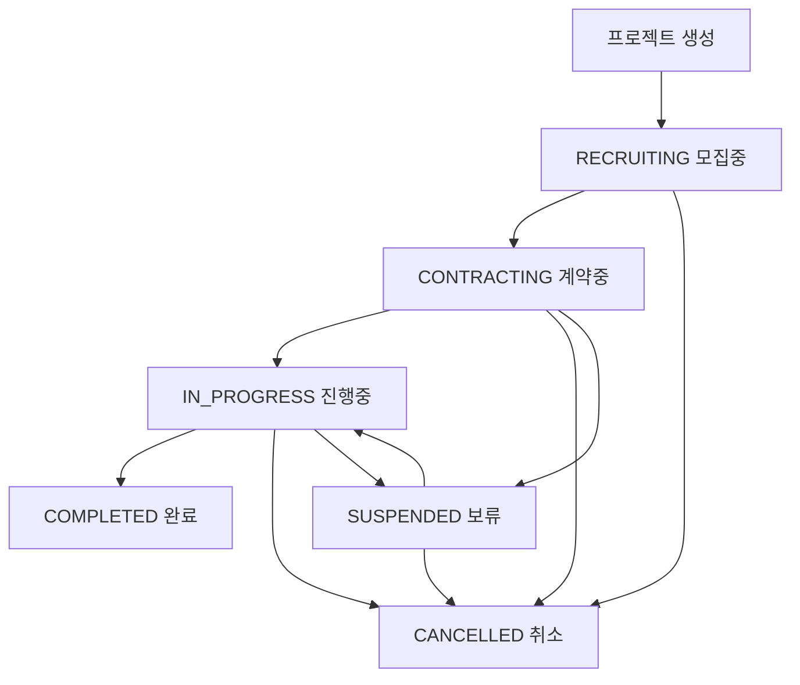

# FIT (Freelancer In Talent)

## 🖼 팀 로고


---

## 🎯 프로젝트 기획 의도

재능 있는 프리랜서를 찾고 싶은 개인/기업과  
자신의 역량을 뽐낼 곳을 찾는 프리랜서를 매칭해 주기 위해 기획된 서비스입니다.

---

## ⏱ 프로젝트 기간

2025-09-30 ~ 2025-10-17

---

## 👥 팀 구성

| 이름   | 역할                 |
| ------ | -------------------- |
| 주권영 | 프리랜서 시스템 담당 |
| 윤주찬 | 매칭 시스템 담당     |
| 임창기 | 회원(인증/인가) 담당 |
| 노현정 | 리뷰 시스템 담당     |
| 박세웅 | 프로젝트 시스템 담당 |

## 📊 ERD


[🖇️프로젝트 기획서](https://docs.google.com/document/d/1PD3yM3Cr9iM2A3SR_RuV55shsZZV8VNEI8OYdJPGR-g/edit?tab=t.0)
[🗂️요구사항 명세서](https://docs.google.com/spreadsheets/d/1OK-HBNcrST9EQMIjLO1d9hLz0GUtSQX4-IckdACsfG4/edit?gid=0#gid=0)

---

# 메인 화면


---

# FIT 회원 기능 정리

## 🛠️기술 스택

### 백엔드

- Java 21, Spring Boot 3.5.6
- Spring Security, JWT
- JPA (MySQL), Redis
- 이메일 발송: Spring Boot Mail
- API 문서: Springdoc OpenAPI

### 프론트엔드

- Next.js, React
- Tailwind CSS

### 기타

- Lombok

## 🗂️백엔드 디렉토리 구조

```jsx
🟦 Controller: API 요청/응답 처리
🟩 DTO: 요청/응답 데이터 구조
✉️ Email Service: 이메일 관련 기능
🟪 Entity: DB 테이블 매핑
🟫 Repository: DB 접근
🟨 Service: 비즈니스 로직

backend/src/main/java/com/back/domain/member
├── auth
│   ├── controller
│   │   └── 🟦 AuthController.java           # 인증 관련 API (아이디 찾기, 비밀번호 재설정, 인증 코드 발송, 토큰 재발급)
│   └── dto
│       ├── 🟩 FindIdReq.java                # 아이디 찾기 요청 DTO
│       ├── 🟩 FindIdRes.java                # 아이디 찾기 응답 DTO
│       ├── 🟩 SendUpdatePasswordCodeReq.java# 비밀번호 재설정용 인증 코드 요청 DTO
│       └── 🟩 UpdatePasswordReq.java        # 비밀번호 변경 요청 DTO
│
├── email
│   └── service
│       └── ✉️ EmailService.java             # 인증 코드 생성, Redis 저장, 이메일 발송
│
└── member
    ├── controller
    │   └── 🟦 MemberController.java        # 회원가입, 조회, 정보 수정, 로그아웃 API
    │
    ├── dto
    │   ├── 🟩 LoginRequest.java             # 로그인 요청 DTO
    │   ├── 🟩 MemberDto.java                # 회원 정보 DTO
    │   ├── 🟩 MemberJoinReq.java            # 회원가입 요청 DTO
    │   ├── 🟩 MemberLoginReq.java           # 로그인 요청 DTO
    │   ├── 🟩 MemberLoginRes.java           # 로그인 응답 DTO
    │   └── 🟩 UpdateMemberReq.java          # 회원 정보 수정 요청 DTO
    │
    ├── entity
    │   ├── 🟪 Member.java                    # 회원 엔티티
    │   └── 🟪 Role.java                      # 회원 권한 Enum
    │
    ├── repository
    │   └── 🟫 MemberRepository.java          # 회원 DB 접근
    │
    └── service
        ├── 🟨 AuthTokenService.java          # JWT 생성/검증
        ├── 🟨 JwtBlacklistService.java       # 로그아웃 시 AccessToken 블랙리스트
        ├── 🟨 MemberRoleService.java         # 권한 관련 로직
        └── 🟨 MemberService.java             # 회원 조회, 비밀번호 변경, 토큰 검증 등 핵심 로직


```

## 🗂️프론트 디렉토리 구조

```jsx
🟦: 상태 관리/Context
🟩: 회원 관련 페이지(UI)
src
├── app
│   ├── context
│   │   └── UserContext.tsx ― 🟦 상태 관리/Context
│   └── members
│       ├── findid
│       │   └── page.tsx ― 🟩 아이디 찾기 페이지
│       ├── login
│       │   └── page.tsx ― 🟩 로그인 페이지
│       ├── mypage
│       │   └── page.tsx ― 🟩 마이페이지
│       ├── signup
│       │   └── page.tsx ― 🟩 회원가입 페이지
│       └── updatePassword
│           └── page.tsx ― 🟩 비밀번호 변경 페이지

```

## 주요 기능

### 1. 회원가입 & 로그인

- 이메일, 아이디, 비밀번호, 닉네임 입력
- 비밀번호는 **해시 처리 후 DB 저장**
- 로그인 시 **AccessToken**과 **RefreshToken** 발급
  - **AccessToken**: 짧은 만료시간 (예: 1시간), 인증 필터에서 검증
  - **RefreshToken**: DB에 만료시간과 함께 저장, AccessToken 재발급 시 갱신
- 로그아웃 시 AccessToken을 **Redis 블랙리스트**에 등록하여 재사용 방지

### 회원 등급(Role) 정책

- **GENERAL (일반회원)**
  - 회원가입 시 자동 부여
  - 활동 유도를 위해 기본 권한 제공
    - 프로젝트 등록 가능
    - 포트폴리오 등록 가능
- **PROJECT MANAGER (PM)**
  - 프로젝트를 하나 이상 등록한 경우 자동 부여
- **FREELANCER (프리랜서)**
  - 포트폴리오를 하나 이상 등록한 경우 자동 부여
- **PM + FREELANCER**
  - 프로젝트와 포트폴리오가 모두 있는 경우 자동 부여
- **재부여 규칙**
  - 프로젝트와 포트폴리오가 모두 없는 경우 **GENERAL**로 자동 변경

---

## 2. 아이디 찾기 / 비밀번호 재설정

### 아이디 찾기

- 사용자가 이메일 입력
- 랜덤 인증 코드 생성 후 Redis에 저장 (5분 만료)
- JavaMailSender를 사용해 인증 코드 이메일 발송
- 사용자가 인증 코드 입력 → 검증
- 인증 성공 시 해당 이메일에 연결된 **아이디 반환**

### 비밀번호 재설정

- 사용자가 아이디 + 이메일 입력
- 랜덤 인증 코드 생성 후 Redis에 저장 (5분 만료)
- JavaMailSender를 사용해 인증 코드 이메일 발송
- 사용자가 인증 코드 입력 → 검증
- 인증 성공 시 새로운 비밀번호 입력 → DB 업데이트
- 인증/변경 완료 후 사용자에게 성공 메시지 반환

---

## 3. 마이페이지

- 사용자 정보 표시: **아이디, 닉네임, 이메일**
- 일반회원(GENERAL)인 경우:
  - "내 프로젝트 보기" 버튼 → 프로젝트 생성 페이지로 이동
  - "포트폴리오 보기" 버튼 → 포트폴리오 생성 페이지로 이동
- 프로젝트 매니저(PM) 권한 보유 시:
  - 프로젝트 버튼 클릭 → 프로젝트 관리 페이지로 이동
- 프리랜서(FREELANCER) 권한 보유 시:
  - 포트폴리오 버튼 클릭 → 포트폴리오 관리 마이페이지로 이동
- PM + FREELANCER 모두 보유 시:
  - 각각의 버튼 클릭 시 해당 권한에 맞는 페이지로 매핑

---

# FIT 매칭 시스템 기능 정리

## 🛠️ 기술 스택

**Backend:** Java 17+, Spring Boot, Spring Security, JWT, JPA (MySQL)  
**Frontend:** Next.js 13+, React 18, TypeScript, Tailwind CSS

---

## 🗂️ 시스템 구조

### 백엔드

```
domain/matching
├── matchScore         # 매칭 점수 계산
├── projectSubmission  # 프리랜서 지원
├── proposal           # PM 제안
└── message            # 메시징
```

### 프론트엔드

```
app
├── matching           # 매칭 대시보드
├── submissions        # 지원 관리
├── proposals          # 제안 관리
└── messages           # 메시징
```

---

## 주요 기능

### 1️⃣ 매칭 점수 알고리즘 (100점 만점)

```
총점 = 스킬(50) + 경력(30) + 단가(20)
```

#### 스킬 점수 (50점)

| 숙련도       | 가중치 |
| ------------ | ------ |
| ADVANCED     | 1.0    |
| INTERMEDIATE | 0.7    |
| BEGINNER     | 0.4    |

```
매칭률 = (Σ 숙련도 가중치) / 요구 기술 수
점수 = 매칭률 × 50
```

**예시:** React(1.0) + Spring(0.7) + MySQL(0.4) = 2.1 / 3 = 35점

#### 경력 점수 (30점)

- **경력 연수**(15점): (연수 / 10) × 15
- **완료 프로젝트**(8점): (개수 / 10) × 8
- **평점**(7점): (평점 / 5) × 7

#### 단가 점수 (20점)

| 조건          | 점수 |
| ------------- | ---- |
| 범위 내       | 20점 |
| 최대 초과     | 15점 |
| 최소×0.8 이상 | 10점 |
| 최소×0.6 이상 | 5점  |
| 미만          | 0점  |

---

### 2️⃣ 양방향 제안 시스템

#### 프리랜서 지원

```
지원서 작성 → PENDING → PM 검토 → ACCEPTED/REJECTED
```

#### PM 제안

```
제안 전송 → PENDING → 프리랜서 검토 → ACCEPTED/REJECTED/CANCELLED
```

---

## 사용 흐름

### PM 흐름

```
프로젝트 등록 → 매칭 결과 조회 → 제안/지원 받기 → 메시지 → 계약
```

### 프리랜서 흐름

```
프로필 등록 → 매칭 조회 → 지원/제안 받기 → 메시지 → 프로젝트 수행
```

---

## 매칭 점수 계산 프로세스

```
[요청] 매칭 점수 조회
    ↓
[확인] DB에 기존 점수 존재?
    ├─ 있음 → 반환
    └─ 없음 → 자동 계산
        ↓
1. 프로젝트 요구사항 조회
2. 프리랜서 목록 조회
3. 각 프리랜서별 점수 계산
   - 스킬 점수 (50)
   - 경력 점수 (30)
   - 단가 점수 (20)
4. TOP 10 선정 (총점 순)
5. DB 저장
    ↓
[완료] 결과 반환
```

---

## 데이터베이스 설계

```
Member ─ Freelancer ─ FreelancerTech ─ Tech
   │         │
   │         └─ MatchScore
   │
Project ─ MatchScore
   │
   ├─ Submission
   ├─ Proposal ─ Message
```

**핵심 테이블:**

- `match_score`: 총점, 스킬, 경력, 단가 점수, 순위
- `project_submission`: PENDING → ACCEPTED/REJECTED
- `proposal`: PENDING → ACCEPTED/REJECTED/CANCELLED

---

## 주요 문제 해결

### 🐛 Infinite Loading

- **원인:** API 응답 구조 불일치
- **해결:** UserContext의 roles 배열로 통일

### 🐛 TechLevel.EXPERT Enum 오류

- **원인:** 3단계 Enum에 EXPERT(4단계) 데이터 존재
- **해결:** EXPERT → ADVANCED 변경, 가중치 3단계로 통일

### 💡 역할 다중 보유 UX 개선

- **해결:** 역할 선택 모달 + sessionStorage 저장

---

# FIT 프로젝트 기능 정리

```jsx
🟦 Controller: API 요청/응답 처리
🟩 DTO: 요청/응답 데이터 구조
🟪 Entity: DB 테이블 매핑
🟫 Repository: DB 접근
🟨 Service: 비즈니스 로직
🔧 Validator: 데이터 검증
🔄 Util: 유틸리티

backend/src/main/java/com/back/domain/project
├── controller
│   ├── 🟦 ProjectController.java           # 프로젝트 CRUD API (생성, 조회, 수정, 삭제, 상태변경)
│   ├── 🟦 ProjectFavoriteController.java   # 프로젝트 즐겨찾기 API
│   └── 🟦 ProjectFileController.java       # 프로젝트 파일 첨부 API
│
├── dto
│   ├── 🟩 ProjectRequest.java              # 프로젝트 생성/수정 요청 DTO
│   ├── 🟩 ProjectResponse.java             # 프로젝트 응답 DTO
│   ├── 🟩 ProjectStatusChangeRequest.java  # 프로젝트 상태 변경 요청 DTO
│   ├── 🟩 ProjectUpdateRequest.java        # 프로젝트 업데이트 요청 DTO
│   └── 🟩 ProjectValidationMessages.java   # 검증 메시지 상수
│
├── entity
│   ├── 🟪 Project.java                     # 프로젝트 메인 엔티티
│   ├── 🟪 ProjectFavorite.java             # 프로젝트 즐겨찾기 엔티티
│   ├── 🟪 ProjectFile.java                 # 프로젝트 파일 엔티티
│   ├── 🟪 ProjectTech.java                 # 프로젝트 기술스택 엔티티
│   └── enums
│       ├── BudgetRange.java                # 예산 범위 (1만원~1억 이상, 협의)
│       ├── PartnerType.java                # 협력 파트너 유형
│       ├── ProgressStatus.java             # 프로젝트 진행 상태
│       ├── ProjectField.java               # 프로젝트 분야 (기획/디자인/개발)
│       ├── ProjectStatus.java              # 프로젝트 상태 (모집중/계약중/진행중/완료/보류/취소)
│       ├── RecruitmentType.java            # 모집 유형 (프로젝트 단위/개인 인력)
│       ├── Region.java                     # 지역
│       ├── TechCategory.java               # 기술 카테고리
│       └── TechName.java                   # 기술명
│
├── repository
│   ├── 🟫 ProjectRepository.java           # 프로젝트 DB 접근
│   ├── 🟫 ProjectFavoriteRepository.java   # 즐겨찾기 DB 접근
│   ├── 🟫 ProjectFileRepository.java       # 파일 DB 접근
│   └── 🟫 ProjectTechRepository.java       # 기술스택 DB 접근
│
├── service
│   ├── 🟨 ProjectManagementService.java    # 프로젝트 통합 관리 서비스
│   ├── 🟨 ProjectQueryService.java         # 프로젝트 조회 서비스 (페이징, 필터링, 검색)
│   ├── 🟨 ProjectService.java              # 프로젝트 핵심 CRUD 서비스
│   ├── 🟨 ProjectStatusService.java        # 프로젝트 상태 변경 서비스
│   ├── 🟨 ProjectTechService.java          # 프로젝트 기술스택 관리 서비스
│   ├── 🟨 ProjectFileService.java          # 프로젝트 파일 관리 서비스
│   └── 🟨 ProjectFavoriteService.java      # 프로젝트 즐겨찾기 서비스
│
├── validator
│   ├── 🔧 ProjectValidator.java            # 프로젝트 데이터 검증, 권한 검증
│   └── 🔧 FileValidator.java               # 파일 업로드 검증
│
└── util
    └── 🔄 TechCategoryMapper.java          # 기술 카테고리 매핑 유틸리티

backend/src/main/java/com/back/global/util
└── 🔄 EntityDtoMapper.java                 # Entity ↔ DTO 매핑 유틸리티

```

## **🎯 주요 기능**

### **1. 프로젝트 관리 시스템**

### **프로젝트 생성 & 관리**

- **프로젝트 정보 입력**: 제목, 설명, 분야, 모집 유형, 예산, 기간 등
- **기술 스택 관리**: 프로젝트에 필요한 기술들 등록/수정/삭제
- **파일 첨부**: 프로젝트 관련 문서, 이미지 등 첨부 가능
- **권한 관리**: 프로젝트 매니저(PM)만 수정/삭제 가능

### **프로젝트 상태 관리**

- **RECRUITING** (모집중) - 프로젝트 팀원 모집 단계
- **CONTRACTING** (계약중) - 계약 협상 및 체결 단계
- **IN_PROGRESS** (진행중) - 프로젝트 실제 진행 단계
- **COMPLETED** (완료) - 프로젝트 성공적 완료
- **SUSPENDED** (보류) - 일시적 중단 상태
- **CANCELLED** (취소) - 프로젝트 중단/취소

---

### **2. 프로젝트 분야 & 모집 유형**

### **프로젝트 분야**

- **PLANNING** (기획) - 서비스 기획, 비즈니스 모델링
- **DESIGN** (디자인) - UI/UX 디자인, 브랜딩
- **DEVELOPMENT** (개발) - 웹/앱 개발, 시스템 구축

### **모집 유형**

- **PROJECT_CONTRACT** (프로젝트 단위 계약/외주)
  - 프로젝트 전체를 외주로 진행
  - 결과물 중심의 계약
- **PERSONAL_CONTRACT** (개인 인력의 기간/시간제 계약/상주)
  - 개인 단위 인력 채용
  - 시간 또는 기간 기반 계약

---

### **3. 예산 관리 시스템**

### **예산 범위 옵션**

- **RANGE_1_100**: 1만원 ~ 100만원
- **RANGE_100_200**: 100만원 ~ 200만원
- **RANGE_200_300**: 200만원 ~ 300만원
- **RANGE_300_500**: 300만원 ~ 500만원
- **RANGE_500_1000**: 500만원 ~ 1000만원
- **RANGE_1000_2000**: 1000만원 ~ 2000만원
- **RANGE_2000_3000**: 2000만원 ~ 3000만원
- **RANGE_3000_5000**: 3000만원 ~ 5000만원
- **RANGE_5000_OVER**: 5000만원 ~ 1억
- **OVER_1_EUK**: 1억 이상
- **NEGOTIABLE**: 협의

---

### **4. 프로젝트 검색 & 필터링**

### **검색 기능**

- **키워드 검색**: 프로젝트 제목, 설명에서 키워드 검색
- **기술스택 검색**: 특정 기술을 사용하는 프로젝트 검색
- **복합 필터링**: 여러 조건을 조합한 정확한 검색

### **필터링 옵션**

- **프로젝트 상태**: 모집중, 진행중, 완료 등
- **프로젝트 분야**: 기획, 디자인, 개발
- **모집 유형**: 프로젝트 계약, 인력 계약
- **예산 범위**: 최소/최대 예산 설정
- **지역**: 회사 위치 기반 필터링
- **기술스택**: 필요 기술 기반 필터링

### **정렬 기능**

- **최신순**: 등록일 기준 최신 프로젝트 우선
- **즐겨찾기순**: 즐겨찾기 한 프로젝트 내림차순으로 정렬 기능

---

### **5. 즐겨찾기 & 파일 관리**

### **프로젝트 즐겨찾기**

- 즐겨찾기 추가/제거 기능
- 즐겨찾기 내림차순 정렬 버튼 기능

### **파일 첨부 시스템**

- 프로젝트 관련 문서 첨부
- 이미지, PDF, 문서 파일 지원
- 파일 업로드/다운로드 관리
- 파일 용량 및 형식 제한

---

### **6. Entity-DTO 매핑 시스템**

### **EntityDtoMapper 유틸리티**

- **Entity ↔ DTO 변환**: ProjectRequest와 Project 엔티티 간 매핑
- **생성용 매핑**: DTO → Entity 변환 (새 프로젝트 생성 시)
- **수정용 매핑**: 기존 Entity에 DTO 값 적용 (프로젝트 수정 시)
- **Null 안전성**: null 값은 업데이트하지 않고 기존 값 유지

### **매핑 기능**

**📝 생성용 매핑 (toEntity)**

```java
// ProjectRequest → Project 엔티티 변환
Project project = EntityDtoMapper.toEntity(request);

```

- 필수 필드: title, description, projectField, recruitmentType, budgetType, startDate, endDate
- 선택 필드: partnerType, budgetAmount, progressStatus, companyLocation, partnerEtcDescription
- manager 필드는 서비스 레이어에서 별도 설정

**🔄 수정용 매핑 (updateEntity)**

```java
// 기존 Project 엔티티에 ProjectRequest 적용
EntityDtoMapper.updateEntity(project, request);

```

- **부분 업데이트 지원**: null이 아닌 필드만 업데이트
- **자동 타임스탬프**: modifyDate 자동 설정
- **안전한 업데이트**: 기존 데이터 보존

## **🔄 프로젝트 생명 주기**



## **📊 주요 API 엔드포인트**

### **프로젝트 기본 CRUD**

- `GET /api/projects` - 프로젝트 목록 조회 (페이징, 필터링)
- `GET /api/projects/{id}` - 프로젝트 상세 조회
- `POST /api/projects/complete` - 프로젝트 생성
- `PUT /api/projects/{id}/complete` - 프로젝트 수정
- `DELETE /api/projects/{id}` - 프로젝트 삭제

### **프로젝트 상태 관리**

- `PATCH /api/projects/{id}/status` - 프로젝트 상태 변경
- `GET /api/projects/{id}/status` - 프로젝트 상태 조회

### **사용자 별 프로젝트**

- `GET /api/projects/manager/{managerId}` - 특정 사용자의 프로젝트 목록

### **즐겨찾기 & 파일**

- `POST /api/projects/{id}/favorites` - 즐겨찾기 추가
- `DELETE /api/projects/{id}/favorites` - 즐겨찾기 제거
- `POST /api/projects/{id}/files` - 파일 업로드
- `DELETE /api/projects/files/{fileId}` - 파일 삭제

---

# 🧑‍💻 프리랜서 기능 정리

## 🗂️백엔드 디렉토리 구조

```jsx
🟦 Controller: API 요청/응답 처리
🟩 DTO: 요청/응답 데이터 구조
🟪 Entity: DB 테이블 매핑
🟫 Repository: DB 접근
🟨 Service: 비즈니스 로직

backend/src/main/java/com/back/domain/freelancer
├── career
│   ├── controller
│   │   └── 🟦 CareerController.java             # 경력 관련 API
│   ├── dto
│   │   ├── 🟩 CareerRequestDto.java             # 경력 생성/수정 요청 DTO
│   │   └── 🟩 CareerResponseDto.java            # 경력 응답 DTO
│   ├── entity
│   │   └── 🟪 Career.java                       # 경력 엔티티
│   ├── repository
│   │   └── 🟫 CareerRepository.java             # 경력 DB 접근
│   └── service
│       └── 🟨 CareerService.java                # 경력 서비스
├── freelancer
│   ├── controller
│   │   └── 🟦 FreelancerController.java         # 프리랜서 관련 API
│   ├── dto
│   │   ├── 🟩 FreelancerDetailResponseDto.java  # 프리랜서 세부 조회 응답 DTO
│   │   ├── 🟩 FreelancerDto.java                # 프리랜서 생성 시 응답 DTO
│   │   ├── 🟩 FreelancerListResponseDto.java    # 프리랜서 목록 조회 응답 DTO
│   │   ├── 🟩 FreelancerSaveRequestDto.java     # 프리랜서 생성 요청 DTO
│   │   └── 🟩 FreelancerUpdateRequestDto.java   # 프리랜서 수정 요청 DTO
│   ├── entity
│   │   └── 🟪 Freelancer.java                   # 프리랜서 엔티티
│   ├── repository
│   │   └── 🟫 FreelancerRepository.java         # 프리랜서 DB 접근
│   └── service
│       ├── 🟨 FreelancerFinder.java             # 프리랜서 조회 전용 서비스
│       └── 🟨 FreelancerService.java            # 프리랜서 CRUD 서비스
├── freelancerTech
│   ├── controller
│   │   └── 🟦 FreelancerTechController.java     # 기술스택 관련 API
│   ├── dto
│   │   ├── 🟩 FreelancerTechAddDto.java         # 기술스택 생성 요청 DTO
│   │   ├── 🟩 FreelancerTechDto.java            # 기술스택 생성 시 응답 DTO
│   │   └── 🟩 FreelancerTechUpdateDto.java      # 기술스택 수정 요청 DTO
│   ├── entity
│   │   ├── 🟪 FreelancerTech.java               # 프리랜서 기술스택 엔티티
│   │   └── 🟪 TechLevel.java                    # 기술스택 숙련도 Enum
│   ├── repository
│   │   └── 🟫 FreelancerTechRepository.java     # 기술스택 DB 접근
│   └── service
│       └── 🟨 FreelancerTechService.java        # 기술스택 CRUD 서비스
└── portfolio
    ├── controller
    │   └── 🟦 PortfolioController.java          # 포트폴리오 관련 API
    ├── dto
    │   ├── 🟩 PortfolioResponseDto.java         # 포트폴리오 응답 DTO
    │   ├── 🟩 PortfolioSaveRequestDto.java      # 포트폴리오 생성 요청 DTO
    │   └── 🟩 PortfolioUpdateRequestDto.java    # 포트폴리오 수정 요청 DTO
    ├── entity
    │   └── 🟪 Portfolio.java                    # 포트폴리오 엔티티
    ├── repository
    │   └── 🟫 PortfolioRepository.java          # 포트폴리오 DB 접근
    └── service
        └── 🟨 PortfolioService.java             # 포트폴리오 서비스

backend/src/main/java/com/back/global/fileStorage
├── FileStorageService.java                      # 이미지 처리 담당 서비스
└── FileType.java                                # 이미지 구분 Enum
```

---

## 🗂️프론트 디렉토리 구조

```jsx
🟦: 상태 관리/Context
🟩: 페이지(UI)

src/app/freelancers
├── [id]
│   ├── page.tsx            # 프리랜서 세부 페이지
│   └── update
│       └── page.tsx        # 프리랜서 수정 페이지
├── mypage
│   └── page.tsx            # 프리랜서 마이페이지
├── page.tsx                # 프리랜서 전체 목록 페이지
├── portfolios
│   ├── [id]
│   │   └── update
│   │       └── page.tsx    # 포트폴리오 수정 페이지
│   └── write
│       └── page.tsx        # 포트폴리오 작성 페이지
└── write
    └── page.tsx            # 프리랜서 등록 페이지
```

---

## 🛠️ 주요 기능

### 1. 프리랜서 등록 및 관리

- 인증정보를 통해 member 엔티티와 1:1 매핑
  - 로그인 사용자만 등록 가능
- 프리랜서 등록 : 프로필 이미지, 소개 제목, 지역, 분야, 소개글, 상주 가능여부, 월 단가 등 기입
- 수정, 삭제 기능
  - 삭제 시 외래키로 참조하고 있는 모든 필드(포트폴리오, 경력, 기술스택) 삭제
- 이미지 파일 미첨부 시 null / 프론트에서 기본 이미지 로드

### 2. 포트폴리오 생성 및 관리

- 프리랜서와 1:N 매핑
- 포트폴리오 등록 : 대표이미지, 설명, 기간, 기여도, 외부링크 기입
- 수정, 삭제 기능

### 3. 경력 생성 및 관리

- 프리랜서와 1:N 매핑
- 생성, 수정, 삭제 기능
- freelancer의 CareerList로 조회

### 4. 기술스택

- freelancer와 tech의 N:M 매핑 테이블 생성 [FreelancerTech]
- techLevel(Enum) 을 통한 숙련도 구분
- 기술스택 추가 기능
  1. tech DB에서 가용한 기능 검색
  2. 추가할 기능 선택
  3. techLevel 지정 후 등록
- 삭제 기능

### 5. 이미지 파일 처리

- 이미지 저장, 수정, 삭제
  - `FileStorageService` 로 Bean 등록
  - FileType(Enum)을 통한 이미지 저장 경로 설정
    - Type만 추가하면 어떤 이미지 처리 로직에서도 활용 가능
- 이미지 조회
  - `WebMvcConfigurer` 의 `addResourceHandlers` 오버라이드 함수로 DB 경로 조회

### 6. 프리랜서 조회, 검색

- 등록된 전체 프리랜서 조회
- 필터링 옵션 : 유형(기획, 디자인, 개발), 지역, 상주 가능 여부
- 검색 기능 : 유저네임, 프리랜서 타이틀, 소개, 기술스택에서 검색
- 프로젝트 버튼 클릭 → 프로젝트 관리 페이지로 이동

---

# FIT 리뷰 기능 정리

## 🗂️백엔드 디렉토리 구조

```jsx
🟦 Controller: API 요청/응답 처리
🟩 DTO: 요청/응답 데이터 구조
🟪 Entity: DB 테이블 매핑
🟫 Repository: DB 접근
🟨 Service: 비즈니스 로직

backend/src/main/java/com/back/domain/review
├── controller
│   └── 🟦 ReviewController.java            # 리뷰 CRUD API (등록, 조회, 수정, 삭제)
│
├── dto
│   ├── 🟩 ReviewRequestDto.java            # 리뷰 생성/수정 요청 DTO
│   └── 🟩 ReviewResponse.java              # 리뷰 응답 DTO
│
├── entity
│   └── 🟪 Review.java                      # 리뷰 메인 엔티티
│
├── repository
│   └── 🟫 ReviewRepository.java            # 리뷰 DB 접근
│
└── service
    └── 🟨 ReviewService.java               # 리뷰 핵심 CRUD 서비스
```

## 🗂️프론트 디렉토리 구조

```jsx
🟦: API 요청 처리
🟩: 페이지(UI)

src  
├── app
│    ├── review
│	   │   ├── 🟩 page.tsx            # 리뷰 작성 페이지
│	 	 │   └── edit
│		 │       └── [reviewId]
│		 │           └── 🟩 page.tsx        # 리뷰 수정 페이지
│		 │
│		 └── reviewlist
│		     ├── 🟩 page.tsx            # 전체 리뷰 목록 페이지
│		     └── [userId]
│		         └── 🟩 page.tsx        # 특정 사용자 리뷰 목록 페이지
│		
├── lib
│		└── 🟦 reviewApi.ts             # 리뷰 관련 API 요청 처리
│
│
│
```

## **🎯 리뷰 시스템 (Review System)**

### **1. 리뷰 등록 (Create Review)**

- 프로젝트 완료 시점에 **리뷰 작성 모달**이 자동으로 뜨며, 사용자가 후기를 남길 수 있습니다.
- 필수 입력값:
    - **제목(title)** – 리뷰 주제
    - **내용(content)** – 후기 본문
    - **평점(rating)** – 별 클릭으로 표시 (1~5점)
- 리뷰 등록 시 즉시 DB에 저장되고, 작성자는 자동으로 **“내 리뷰 목록 페이지”**로 이동합니다.
- 등록 성공 시 알림창(Alert)을 통해 완료 여부가 표시됩니다.

📸 *UI 특징:*

- 직관적인 입력 폼과 별점 UI 구성
- Tailwind CSS와 인라인 스타일을 혼용해 깔끔하고 반응형 디자인 유지

---

### **2. 리뷰 조회 (Read Review)**

- **모든 사용자 리뷰 조회 페이지**에서 전체 리뷰를 볼 수 있습니다.
- 리뷰는 **최신순(날짜 내림차순)**으로 정렬되어 표시됩니다.
- 각 리뷰 카드에는 다음 정보가 포함됩니다:
    - 리뷰 제목, 내용
    - 작성일, 작성자 ID
    - 평점(별 개수로 시각화)
    - 프로젝트 ID
- 상단에는 전체 통계 표시:
    - **총 리뷰 수**
    - **평균 평점**
- 한 페이지에 6개의 리뷰가 표시되며, **페이지네이션 기능**으로 더 많은 리뷰를 탐색할 수 있습니다.

📸 *UI 특징:*

- “전체 보기”와 평점별 필터(★1~5)를 버튼으로 구분
- 시각적으로 구분된 카드형 리스트 디자인

---

### **3. 리뷰 정렬 (Sort Review)**

- 사용자는 리뷰를 **평점 기준으로 정렬**할 수 있습니다.
- 정렬 옵션:
    - **높은 평점순**
    - **낮은 평점순**
    - **특정 평점(예: ★5만 보기)**
- 선택한 평점 필터에 따라 해당 평점을 가진 리뷰만 표시되며, 총 개수도 함께 표시됩니다.

📸 *UI 특징:*

- 평점 버튼 클릭 시 동적 필터링
- 평균 평점, 리뷰 수 실시간 갱신

---

### **4. 특정 사용자 리뷰 조회 (User-Specific Reviews)**

- 특정 사용자가 작성한 리뷰만 조회할 수 있습니다.
- URL 파라미터로 **userId**를 받아 해당 유저의 리뷰를 표시합니다.
- 각 리뷰 카드에 “수정” 및 “삭제” 버튼이 표시되며, **작성자 본인만 접근 가능**합니다.
- 삭제 시 “이 리뷰를 삭제하시겠습니까?” 모달이 뜨며, 확인 후 삭제가 진행됩니다.

📸 *UI 특징:*

- 사용자 ID별 페이지 헤더
- 버튼 색상 구분 (수정: 파랑 / 삭제: 빨강)

---

### **5. 리뷰 수정 & 삭제 (Update & Delete Review)**

- 수정 페이지 진입 시 기존 리뷰 정보(제목, 내용, 평점)가 자동으로 불러와집니다.
- 수정 가능한 항목:
    - 제목
    - 내용
    - 평점(별 클릭으로 변경 가능)
- 수정 완료 시 알림창을 통해 “리뷰가 수정되었습니다” 메시지가 표시되고, 다시 해당 사용자의 리뷰 페이지로 이동합니다.
- 삭제 시 확인창(Alert)으로 재확인 후, DB에서 즉시 삭제됩니다.

📸 *UI 특징:*

- 입력 폼 구조는 등록 페이지와 동일
- 수정 후 실시간 반영 및 페이지 새로고침 없이 업데이트

---

## **📊 주요 기능 흐름**

| 기능        | 설명              | 접근 경로                        |
| --------- | --------------- | ---------------------------- |
| 리뷰 등록     | 프로젝트 완료 후 후기 작성 | `/review/create`             |
| 전체 리뷰 조회  | 모든 사용자의 리뷰 보기   | `/reviews/all`               |
| 평점별 정렬    | 평점순 필터링 및 정렬    | `/reviews/all?sort=rating`   |
| 특정 사용자 리뷰 | 특정 유저가 쓴 리뷰만 조회 | `/reviews/user/{id}`         |
| 리뷰 수정     | 작성자만 수정 가능      | `/reviews/edit/{reviewId}`   |
| 리뷰 삭제     | 작성자만 삭제 가능      | `/reviews/delete/{reviewId}` |

